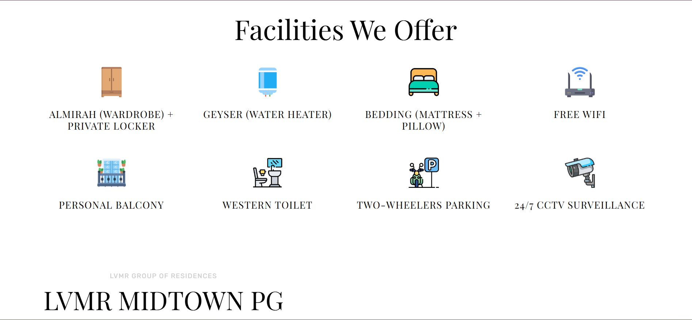
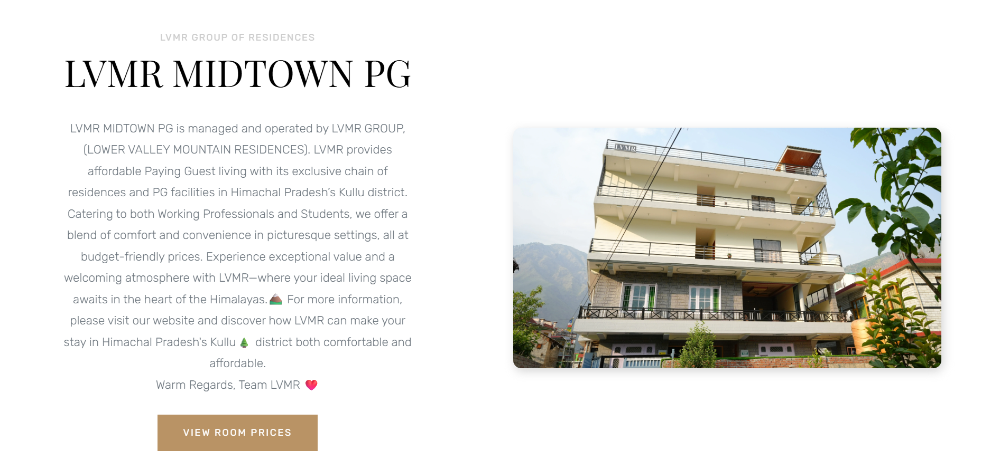
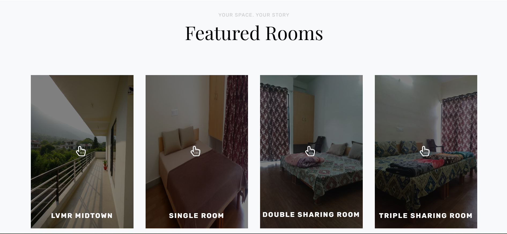
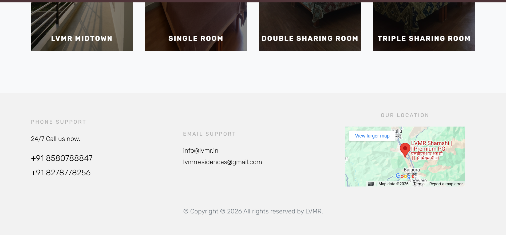
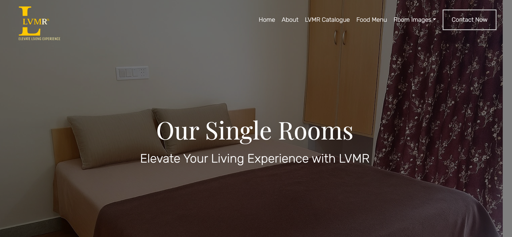
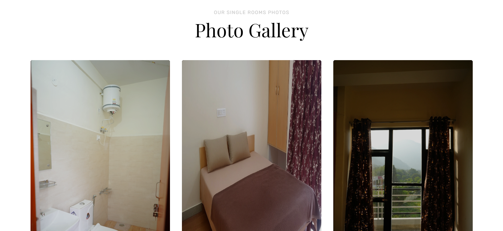

# LVMR MIDTOWN 

## Elevate Your Living Experience  
**PG (Paying Guest) for Working Professionals & Students**

LVMR MIDTOWN PG is managed and operated by **LVMR GROUP (Lower Valley Mountain Residences)**.  
We provide affordable, comfortable, and well-equipped PG accommodations in **Shamshi, Kullu (Himachal Pradesh)**, catering to both students and working professionals.

Set in the serene Himalayas 🏔️, LVMR offers a perfect balance of comfort, convenience, and budget-friendly living with modern facilities and a welcoming atmosphere.

Warm Regards,  
**Team LVMR ❤️**

🚀 Live Website 🔗 https://lvmr.in/

## 📸 Screenshots

  

  

  

  

  

  

  

> Clean, modern UI with smooth navigation and fully responsive design.

## ✨ Features

- ⚡ Fast & lightweight static website
- 📱 Fully responsive (mobile-first)
- 🎠 Hero image carousel
- 🏠 Room gallery with categories
- 🔍 SEO optimized (Meta tags + Schema)
- 📍 Google Maps integration
- 📞 One-click call & email support
- 🔒 CCTV & safety-focused facility highlights

## 🛠 Tech Stack

### Frontend
- **HTML5**
- **CSS3**
- **JavaScript**

### UI & Styling
- **Bootstrap**
- **Custom CSS**
- **Animate.css**
- **Google Fonts** (Playfair Display, Rubik)
- **Font Awesome**
- **Ionicons**

### JavaScript Libraries
- **jQuery**
- **Owl Carousel**
- **Magnific Popup**
- **jQuery Waypoints**
- **jQuery Stellar (Parallax)**

### SEO & Optimization
- **Meta Tags**
- **Open Graph (Facebook)**
- **Twitter Cards**
- **Schema.org JSON-LD (LodgingBusiness)**
- **WebP images for performance**

### Hosting & Deployment
- **Static Hosting (Netlify / Vercel compatible)**

### Admin pricing save flow
This project now supports a secure Netlify serverless function that can commit updated pricing values directly to GitHub.

To enable it, set these Netlify environment variables:
- `GITHUB_TOKEN` – a GitHub Personal Access Token with `repo` permission.
- `GITHUB_REPO` – your repository in `owner/repo` format, for example `yourname/lvmr`.
- `GITHUB_BRANCH` – optional branch name to commit into (defaults to `dev`).

How to create the GitHub token:
1. Open GitHub and go to your profile icon > Settings.
2. In the left menu, choose `Developer settings`.
3. Select `Personal access tokens` and then `Tokens (classic)`.
4. Click `Generate new token`, choose a name, set an expiration, and enable the `repo` scope.
5. Copy the token and add it to Netlify as `GITHUB_TOKEN`.

How to find `GITHUB_REPO`:
- Use the repo path from your GitHub URL, e.g. `github.com/yourname/lvmr` becomes `yourname/lvmr`.

Then open the admin page and click the save button. The UI will post the new pricing config to `/.netlify/functions/save-prices`.

## 📍 Location
**Shamshi, Kullu – Himachal Pradesh, India**  
Near Bhuntar Airport & NH connectivity

## 📞 Contact

- **Phone:** +91 8580788847, +91 8278778256  
- **Email:** info@lvmr.in  
- **Website:** https://lvmr.in/

© 2025 **LVMR Group**. All rights reserved.
